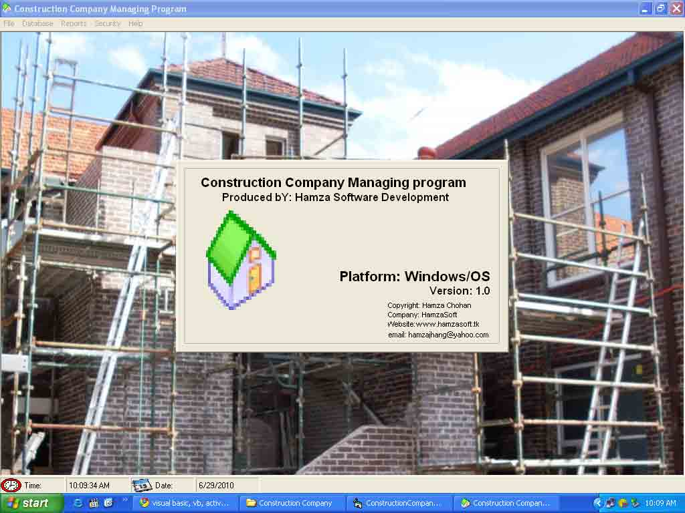

## Construction Company Managing Program

### Description

This Program is Created for Managing Different Purposes Like Saving Information of Customer, Employees and Orders of a Construction Company
 
### More Info
 

             |
---                |---
**Submitted On**   |2010-05-28 03:55:28
**By**             |[HAmza ChohAn](https://github.com/Planet-Source-Code/PSCIndex/blob/master/ByAuthor/hamza-chohan.md)
**Level**          |Beginner
**User Rating**    |4.7 (14 globes from 3 users)
**Compatibility**  |VB 6\.0
**Category**       |[Complete Applications](https://github.com/Planet-Source-Code/PSCIndex/blob/master/ByCategory/complete-applications__1-27.md)
**World**          |[Visual Basic](https://github.com/Planet-Source-Code/PSCIndex/blob/master/ByWorld/visual-basic.md)
**Archive File**   |[Constructi2181985292010\.zip](https://github.com/Planet-Source-Code/hamza-chohan-construction-company-managing-program__1-73182/archive/master.zip)

